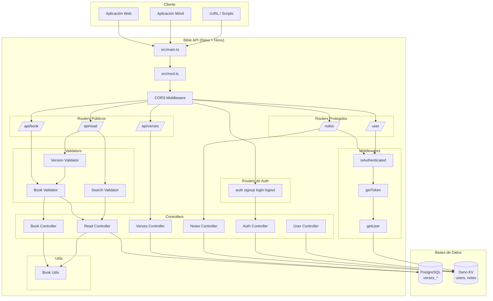
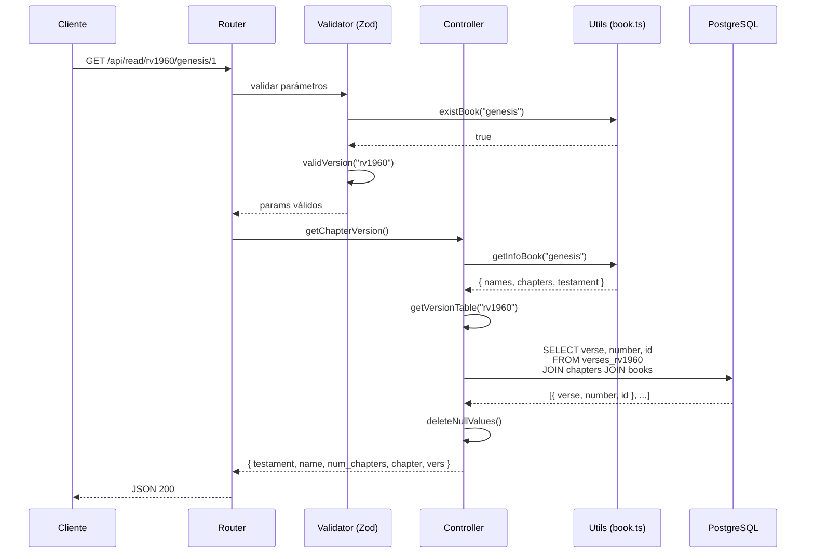
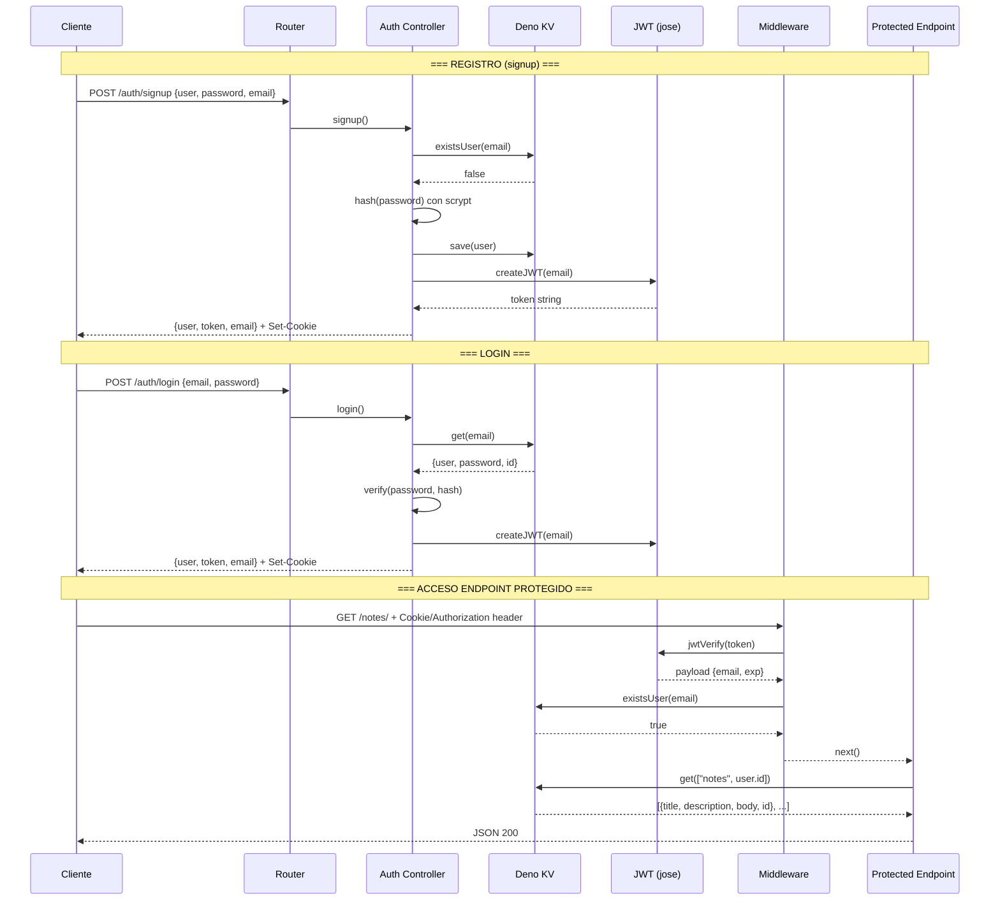
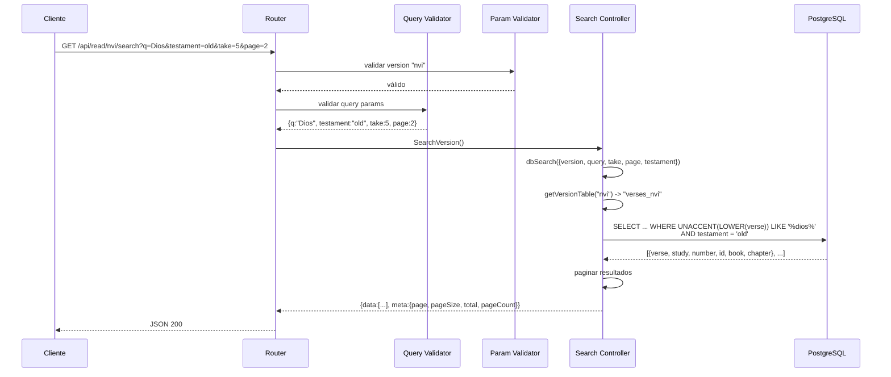
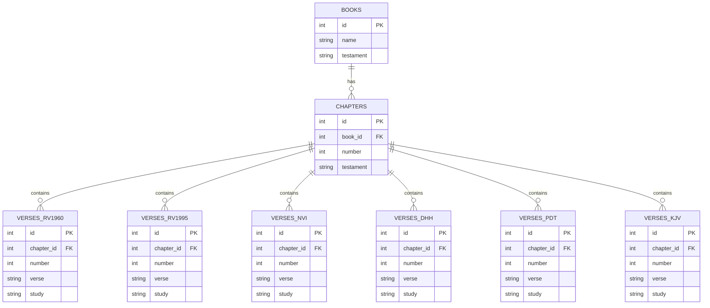

# Arquitectura

## Visión General

BibleApi es una API REST construida con **Deno** y el framework **Hono**. Sigue un patrón MVC-like con separación clara de responsabilidades en routers, controllers, middlewares y validators.

## Diagrama de Arquitectura



## Flujo de Consulta de Versículos



## Flujo de Autenticación y Acceso Protegido



## Flujo de Búsqueda



## Diagrama de Bases de Datos



```mermaid
graph LR
    subgraph "Deno KV - Usuarios"
        UE["users_by_email", email] --> UD{UserData<br/>user, password, email, id, active}
        UU["users", username] --> UD2{UserData}
    end

    subgraph "Deno KV - Notas"
        NK["notes", user.id] --> ND[Note[]<br/>title, description, body, id, page?]
    end

    UD -. same data .-> UD2
```

## Estructura del Proyecto

```
BibleApi/
├── src/
│   ├── main.ts                 # Punto de entrada (Deno.serve)
│   ├── mod.ts                  # Configuración de la app Hono + rutas
│   ├── constants.ts            # Libros, versiones, esquemas Zod
│   ├── userRepository.ts       # Repositorio de usuarios (Deno KV)
│   │
│   ├── routers/
│   │   ├── api/
│   │   │   ├── book.ts         # Rutas /api/book/*
│   │   │   ├── read.ts         # Rutas /api/read/*
│   │   │   ├── verses.ts       # Rutas /api/verses/*
│   │   │   └── notes.ts        # Rutas /notes/*
│   │   └── auth/
│   │       ├── index.ts        # Rutas /auth/signup, /login, /logout
│   │       └── user.ts         # Rutas /user/*
│   │
│   ├── controllers/
│   │   ├── api/
│   │   │   ├── book.ts         # getBookInfo, getBooks, getTestamentBooks
│   │   │   ├── read.ts         # getChapterVersion, getOneVerseVersion, SearchVersion
│   │   │   ├── verses.ts       # GetAcrossVersions
│   │   │   ├── version.ts      # getVersions
│   │   │   └── random.ts       # randomVerse
│   │   ├── auth/
│   │   │   ├── index.ts        # signup, login, logout
│   │   │   └── user.ts         # getUserInfo, deleteUser
│   │   └── notes.ts            # CRUD de notas
│   │
│   ├── middlewares/
│   │   ├── authorization.ts    # isAuthenticated, getToken
│   │   ├── user.ts             # getUser desde JWT
│   │   └── search.ts           # Middleware de búsqueda
│   │
│   ├── validators/
│   │   ├── book.ts             # validación de libro y capítulo
│   │   ├── version.ts          # validación de versión
│   │   ├── search.ts           # validación de query params
│   │   └── mod.ts              # Exportaciones
│   │
│   ├── database/
│   │   ├── index.ts            # Conexión PostgreSQL
│   │   └── cache.ts            # Cache Redis (implementado, no activo)
│   │
│   ├── utils/
│   │   └── book.ts             # Utilidades de libros (abreviaciones, testamentos)
│   │
│   └── scraping/
│       ├── scrape.ts           # Scraping base
│       ├── search.ts           # Scraping de búsqueda
│       └── logger.ts           # Logger para scraping
│
├── scripts/
│   ├── scrapeVersion.ts        # Script para scrapea versión
│   └── fillVersionDB.ts        # Script para llenar BD
│
├── tests/
│   ├── book.test.ts
│   ├── verses.test.ts
│   ├── search.test.ts
│   ├── setup.ts
│   └── test.hurl
│
├── deno.json                   # Configuración de Deno y tareas
├── import_map.json             # Import map de Deno
├── Dockerfile                  # Imagen Docker
└── README.md
```
