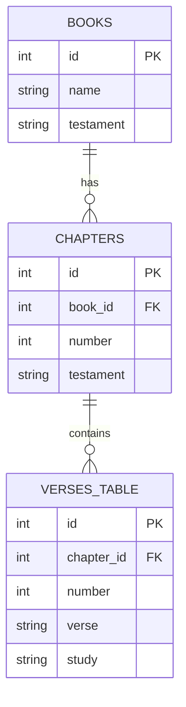

# Modelos de Datos

## Constantes de la Biblia

### Libros (`Book`)

Cada libro de la Biblia se representa con la siguiente estructura:

```typescript
interface Book {
  names: string[];       // Nombres en español e inglés
  abrev: string;         // Abreviación
  chapters: number;      // Número de capítulos
  testament: Testament;  // "Antiguo Testamento" | "Nuevo Testamento"
  englishName?: string;  // Nombre en inglés (opcional)
}
```

**Ejemplo:**
```json
{
  "names": ["Genesis"],
  "abrev": "GN",
  "chapters": 50,
  "testament": "Antiguo Testamento"
}
```

```json
{
  "names": ["Exodo", "Exodus"],
  "abrev": "EX",
  "chapters": 40,
  "testament": "Antiguo Testamento"
}
```

```json
{
  "names": ["Juan", "John"],
  "abrev": "JN",
  "chapters": 21,
  "testament": "Nuevo Testamento"
}
```

### Versiones (`Version`)

```typescript
enum Version {
  Rv60 = "rv1960",  // Reina Valera 1960
  Rv95 = "rv1995",  // Reina Valera 1995
  Nvi = "nvi",      // Nueva Versión Internacional
  Dhh = "dhh",      // Dios Habla Hoy
  Pdt = "pdt",      // Palabra de Dios para Todos
  KJV = "kjv",      // King James Version
}
```

### Versículo (`Verse`)

```typescript
interface Verse {
  verse: string;   // Texto del versículo
  number: number;  // Número de versículo
  study?: string;  // Notas de estudio (opcional, puede ser null)
  id: number;      // ID numérico
}
```

**Ejemplo:**
```json
{
  "verse": "En el principio creó Dios los cielos y la tierra.",
  "number": 1,
  "id": 1
}
```

Con notas de estudio:
```json
{
  "verse": "En el principio creó Dios los cielos y la tierra.",
  "number": 1,
  "study": "Ver Juan 1:1-3; Colosenses 1:16-17",
  "id": 1
}
```

### Nombre de Versión

```typescript
function getVersionName(version: Version): string
```

| Versión | Nombre |
|---------|--------|
| `rv1960` | Reina Valera 1960 |
| `rv1995` | Reina Valera 1995 |
| `nvi` | Nueva version internacional |
| `dhh` | Dios habla hoy |
| `pdt` | Palabra de Dios para todos |
| `kjv` | King James Version |

---

## Base de Datos PostgreSQL

### Esquema Relacional



### Tablas de Versículos

Existen **6 tablas** de versículos, una por versión:

| Tabla | Versión |
|-------|---------|
| `verses_rv1960` | Reina Valera 1960 |
| `verses_rv1995` | Reina Valera 1995 |
| `verses_nvi` | Nueva Versión Internacional |
| `verses_dhh` | Dios Habla Hoy |
| `verses_pdt` | Palabra de Dios para Todos |
| `verses_kjv` | King James Version |

### Tabla `books`

| Columna | Tipo | Descripción |
|---------|------|-------------|
| `id` | int | Identificador único (PK) |
| `name` | string | Nombre del libro |
| `testament` | string | Testamento |

### Tabla `chapters`

| Columna | Tipo | Descripción |
|---------|------|-------------|
| `id` | int | Identificador único (PK) |
| `book_id` | int | FK a `books.id` |
| `number` | int | Número de capítulo |
| `testament` | string | Testamento |

### Tablas `verses_*`

| Columna | Tipo | Descripción |
|---------|------|-------------|
| `id` | int | Identificador único (PK) |
| `chapter_id` | int | FK a `chapters.id` |
| `number` | int | Número de versículo |
| `verse` | string | Texto del versículo |
| `study` | string/null | Notas de estudio |

### Ejemplo de Query

Obtener todos los versículos de Génesis capítulo 1 en RV1960:

```sql
SELECT verse, study, verses_rv1960.number, verses_rv1960.id
FROM verses_rv1960
JOIN chapters ON verses_rv1960.chapter_id = chapters.id
JOIN books ON books.id = chapters.book_id
WHERE chapter = 1 AND books.name = 'Genesis';
```

### Query para Comparar Versiones

```sql
SELECT
  vd.verse AS verse_dhh,
  vp.verse AS verse_pdt,
  vrv.verse AS verse_rv1960,
  vr.verse AS verse_rv1995
FROM verses_dhh vd
  JOIN verses_rv1995 vr ON vd.chapter_id = vr.chapter_id
  JOIN verses_pdt vp ON vd.chapter_id = vp.chapter_id
  JOIN verses_rv1960 vrv ON vd.chapter_id = vrv.chapter_id
WHERE vd.chapter_id = $1
  AND vr.number = $2 AND vd.number = $2
  AND vp.number = $2 AND vrv.number = $2;
```

---

## Deno KV

### Usuarios

#### Key: `["users_by_email", email]`

```typescript
interface UserData {
  user: string;      // Nombre de usuario
  password: string;  // Hash scrypt de la contraseña
  email: string;     // Email (en minúsculas)
  id: string;        // UUID generado con crypto.randomUUID()
  active: boolean;   // true = activo
}
```

#### Key: `["users", username]`

Mis datos que `["users_by_email", email]`, indexados por nombre de usuario.

### Notas

#### Key: `["notes", user.id]`

```typescript
type Note[] = Array<{
  id: string;          // UUID de la nota
  title: string;       // Título (mín. 8 caracteres)
  description: string; // Descripción (mín. 10 caracteres)
  body: string;        // Contenido (mín. 20 caracteres)
  page?: string;       // URL de referencia (opcional)
}>;
```

### Diagrama de Deno KV

```mermaid
graph LR
    subgraph "Deno KV"
        U1["users_by_email", "user@email.com"] --> UD1{UserData}
        U2["users", "username"] --> UD2{UserData}
        N["notes", "uuid-del-usuario"] --> NA[Note[]]
    end

    UD1 -. mismo usuario .-> UD2
```

---

## Esquemas de Validación (Zod)

### Book

```typescript
// Validación implícita en controllers/api/book.ts
// Se valida existencia del libro y número de capítulo
```

### Search Query

```typescript
const searchSchema = z.object({
  q: z.string().min(1),
  testament: z.enum(["old", "new", "both"]),
  take: z.number().min(1),
  page: z.number().min(1),
});
```

### Note

```typescript
const NoteSchema = z.object({
  title: z.string().min(8),
  description: z.string().min(10),
  body: z.string().min(20),
  page: z.string().url().optional(),
});
```

### Signup

```typescript
const schema = z.object({
  user: z.string(),
  password: z.string().min(8),
  email: z.string().email(),
});
```

### Login

```typescript
const loginSchema = z.object({
  password: z.string().min(8),
  email: z.string().email(),
});
```

---

## Respuestas de Error

### Errores Comunes

| Código | Escenario | Cuerpo |
|--------|-----------|--------|
| 400 | Versión inválida | `{ "error": "Invalid version", "version": "..." }` |
| 400 | Libro inválido | `{ "error": "Invalid book", "book": "..." }` |
| 400 | Capítulo inválido | `{ "error": "Invalid chapter", "chapter": "...", "max_chapters": N }` |
| 400 | Query inválida | `{ "error": "query is required", "path": ["q"] }` |
| 401 | No autenticado | `{ "message": "Unauthorized" }` |
| 404 | Recurso no encontrado | `{ "message": "Not Found" }` |
| 500 | Error del servidor | `{ "message": "Internal server error" }` |
